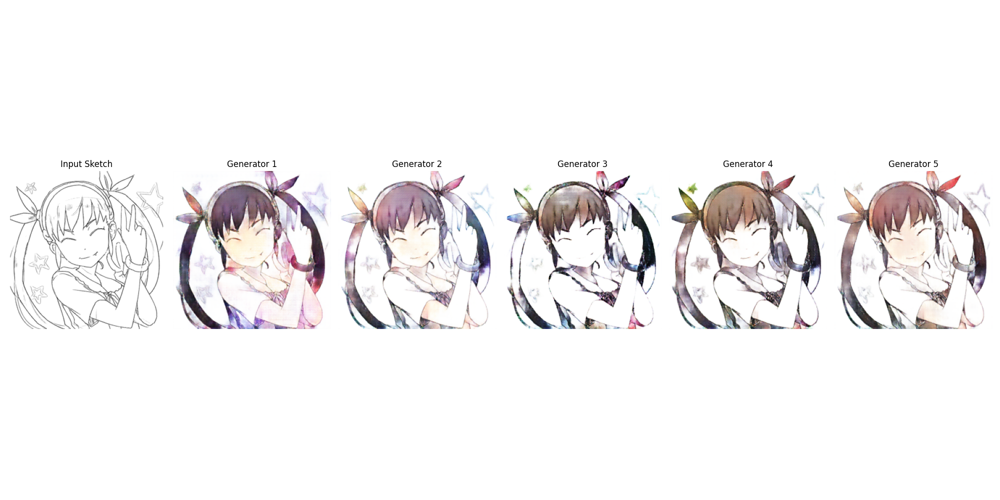
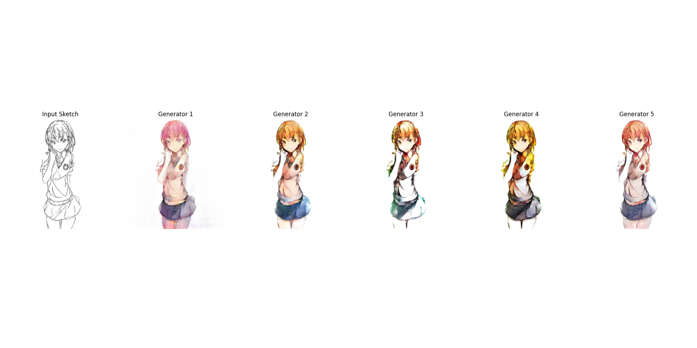
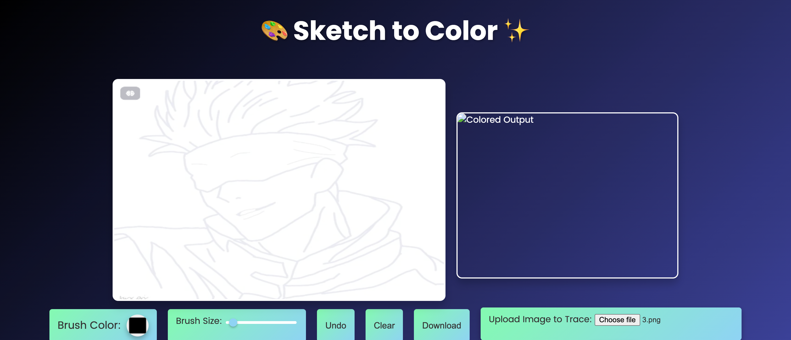
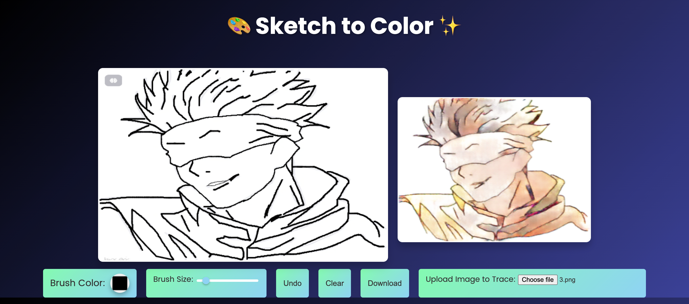

# InkSpire - Sketch to Image with GANs

InkSpire is a web application that leverages Generative Adversarial Networks (GANs) to convert sketches into colored images in real-time. This project combines an interactive frontend canvas with a Flask backend powered by a custom-trained GAN model, which was trained on the [Anime Sketch Colorization Pair Dataset](https://www.kaggle.com/datasets/ktaebum/anime-sketch-colorization-pair). It provides users with a seamless and dynamic sketch-to-image translation experience.


**Contributors:**
- Samrat Ray (IIT2023066)
- Ranjeet Kulkarni (IIT2023064)

**Link to Models (Download the Entire Folder):** 
- https://drive.google.com/drive/folders/1P6_rF7ZAQ83np2US7JAE6TUR4mpTRBqL?usp=sharing

---

## Key Features
- **🌟 Instant Image Transformation**: Sketch your ideas and see them come to life with vibrant colors, powered by GANs.
  
- **✍️ Interactive Drawing Canvas**: Draw freely and watch the AI generate a colorized version of your sketch in real-time.
  
- **🎨 AI-Enhanced Artwork**: Add simple sketches, outlines, or doodles, and let InkSpire enhance them with AI-driven colorization.
  
- **🚀 Seamless User Experience**: With an easy-to-use interface, InkSpire ensures that anyone—from beginners to professionals—can create AI-powered artwork effortlessly.

---

## Requirements

Before starting, ensure you have the following installed:

### **System Requirements**
- Python 3.x
- HTML, CSS, and JavaScript (for the frontend)

### **Python Libraries**
To install the required Python libraries, run:

```bash
pip install -r requirements.txt
```

### **Frameworks**
- Flask (for backend)
- TensorFlow 

---

## Installation

### 1. Clone the Repository
Clone the project to your local machine:

```bash
git clone https://github.com/your-username/inkspire.git
cd inkspire
```

### 2. Install Dependencies
Ensure all dependencies are installed:

```bash
pip install -r requirements.txt
```

### 3. Set Up the Flask Backend
Run the Flask server:

```bash
python app.py
```
This starts the backend server at [http://localhost:5000](http://localhost:5000).

### 4. Frontend Setup
The frontend uses an HTML5 canvas for drawing sketches:

1. Open `index.html` in your browser.
2. Draw sketches on the canvas.
3. View the real-time colorized results generated by the GAN model.

### 5. Running the App
With the Flask server running and the frontend loaded, you can:
- Start drawing on the canvas.
- View the colorized image generated in real-time.

---

## How It Works

### **DataSet**
[Anime Sketch Colorization Pair Dataset](https://www.kaggle.com/datasets/ktaebum/anime-sketch-colorization-pair)

### **Frontend**
- Users draw on an interactive HTML5 canvas.
- JavaScript sends the canvas data to the Flask backend every second.

### **Backend (Flask)**
- Processes the incoming sketches.
- Sends the sketches to the custom-trained GAN model for colorization.

### **GAN Model**
- A custom-trained GAN model generates colored images from sketches.
- The model was trained on the [Anime Sketch Colorization Pair Dataset](https://www.kaggle.com/datasets/ktaebum/anime-sketch-colorization-pair).
- Results are sent back to the frontend for display.

---

## Technologies Used

### **Core Technologies**
- **Generative Adversarial Networks (GANs):** For sketch-to-image translation.
- **Flask:** Python web framework for the backend.
- **TensorFlow:** For implementing and running the GAN model.
- **HTML5 Canvas:** Interactive drawing area for users.
- **JavaScript:** Handles real-time interaction with the backend.

### **Visualization**
1. **GAN Model Outputs:** Compare outputs from 5 trained GAN models to evaluate performance.
2. **User Interface Preview:** Showcase the dashboard design for user interaction.

---

## Screenshots

### **1. GAN Model Outputs**
Below are the outputs of 5 GAN models trained on the sketch-to-image dataset:




### **2. User Interface Preview**
A glimpse of the interactive dashboard for drawing and viewing results:





---

## Contributing

If you'd like to contribute to this project, feel free to:
- Open an issue.
- Create a pull request.

---

## License

This project is licensed under the MIT License. See the `LICENSE` file for details.

---

## Demo


Experience the transformation from sketch to color in action!
